  <picture>
    <source media="(prefers-color-scheme: dark)" srcset="./dark.svg">
    <source media="(prefers-color-scheme: light)" srcset="./light.svg">
    
  </picture>

# Hi, I'm Harshvardhan Srivastava 👋

🎓 B.Tech CSE – KIET Group of Institutions  
🎓 BS in Data Science & AI – IIT Madras  

## 🚀 About Me
- 🤖 Machine Learning Enthusiast
- 📱 Android Developer
- 💻 AI & Data Science
- 🌱 Currently learning Deep Learning

## 🛠️ Skills
Python • Java • C++ • TensorFlow • Flutter • Git • Docker • MySQL • Firebase

## 📫 Connect
- GitHub: https://github.com/Harsh2428
- LinkedIn: https://linkedin.com/in/harshvardhan-srivastava-1038a4323
